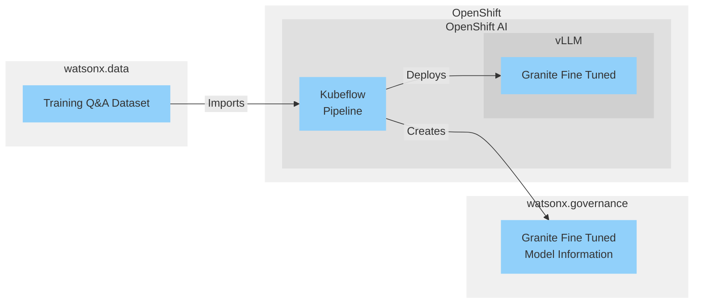

import { Image } from "astro:assets";
import training_pipeline from "../../images/blog/openshift-ai-pipeline/training_pipeline.png";
import model_serving from "../../images/blog/openshift-ai-pipeline/model_serving.png"
import wx_gov_factsheet from "../../images/blog/openshift-ai-pipeline/wx_gov_factsheet.png"
import wx_gov_usecase from "../../images/blog/openshift-ai-pipeline/wx_gov_usecase.png"
import { FaPython } from "react-icons/fa";
import { SiYaml } from "react-icons/si";


## Overview

This post covers how IBM watsonx, Red Hat Openshift AI and IBM Granite can be used to create an LLM fine tuning pipeline with enterprise governance. The aim is to create a workflow which allows easy creation of fine tuned LLMs based on data from disparate sources, and a way to monitor their creation and lifecycle.

This is based on a recent project I worked on alongside <a target="_blank" href="https://jamesdhope.com/">James Hope</a> and <a href="https://www.linkedin.com/in/joevullo/" target="_blank">Joseph Vullo</a> in IBM's Client Engineering. 

## Architecture



| Component | What do we use it for? | Deployment Method |
| - | - | - |
| OpenShift | Red Hat's Kubernetes platform. This runs OpenShift AI, and can also run watsonx.data & watsonx.governance | IBM Cloud ROKS (SaaS) |
| [OpenShift AI](https://www.redhat.com/en/technologies/cloud-computing/openshift/openshift-ai) | Red Hat's platform for AI development on OpenShift. It contains features such as Jupyter notebooks, pipelines with Kubeflow and model serving | OpenShift on IBM Cloud |
| [watsonx.data](https://www.ibm.com/products/watsonx-data) | An AI data platform which allows you to access data from multiple locations and sources in a consistent manner | IBM Cloud SaaS |
| Kubeflow | A tool for running machine learning pipelines | OpenShift AI |
| [watsonx.governance](https://www.ibm.com/products/watsonx-governance) | A platform to allow managing, monitoring and governing of AI models | IBM Cloud SaaS |
| [vLLM](https://docs.vllm.ai/en/latest/) | A service to host LLMs | OpenShift AI |
| [IBM Granite](https://huggingface.co/ibm-granite/granite-3.0-2b-base) | An LLM from IBM suitable for fine tuning | vLLM |

### Components

#### OpenShift & OpenShift AI

OpenShift AI was deployed on an OpenShift cluster on IBM Cloud, allowing us to make use of scalability and add GPU nodes when needed. OpenShift AI was installed through its Operator and deployed by following the <a href="https://docs.redhat.com/en/documentation/red_hat_openshift_ai_self-managed/2.15/html/installing_and_uninstalling_openshift_ai_self-managed/installing-and-deploying-openshift-ai_install#requirements-for-openshift-ai-self-managed_install" target="_blank">instructions</a>.

OpenShift AI is a data science platform offering from Red Hat which allows data scientists to create, train and deploy machine learning models including LLMs. It includes features such as Jupyter notebooks, pipelines with Kubeflow and model serving through a variety of services including vLLM and OpenVINO.

#### watsonx.data

watsonx.data allows access of data from multiple different source types such as CSV files in S3-compatible storage, relational databases and Apache Kafka. For our use case it was only used to access a CSV file from IBM Cloud Object Storage through an SQL interface using the included Presto engine, but the same techniques can be used to access relational data across a wide range of data sources.

#### watsonx.governance

watsonx.governance enables tracking & governance of all of the fine-tuned models created by the pipeline. This is important so that lineage of the data that was used to train the model can be traced, model versions can be tracked, as well as the use cases they're deployed for.

## The Pipeline

The orchestration tool used for the pipeline is Kubeflow. Included as part of OpenShift AI, it's a pipeline tool with a focus on machine learning workflows. It allows us to break down the process into modular reusable steps and easily instantiate runs on the pipeline, either manually or using a schedule. A schedule based workflow could make sense for an LLM application to make sure your model is tuned on the latest data that you'd like for your application. A diagram of our pipeline is show below:

<Image src={training_pipeline} alt="A Kubeflow pipeline which trains an LLM" />
*Above: The LLM fine-tuning pipeline as seen in OpenShift AI*

The pipeline contains the following key stages:
<div class="ml-8">
1. Download the training data from watsonx.data
2. Split the data into training and test datasets
3. Download the foundation model from HuggingFace
4. Fine tune the foundation model using the datasets
5. Deploy the model onto vLLM inside OpenShift AI
6. Test that the model has correctly deployed on the cluster
7. Report the latest version of the model to watsonx.governance
</div>
The icons between the named stages represent artifacts that have been created by the pipeline, which is stored in connected S3-compatible storage.

### Loading the data from watsonx.data
watsonx.data allows access to structured data from different sources. In order to load our Q&A sample dataset in this pipeline, the PrestoDB python library was used to load the dataset and split it into a dataframe. The environment variables are loaded from an OpenShift secret when the container is started for the relevant step in the pipeline. While we do split the data in an 80/20 fashion, this isn't necessarily best practice and was just for the purposes of demonstration.
<details>
  <summary class="cursor-pointer"><FaPython size="20" className="inline-block mr-1 align-text-bottom"/>Code to Load Q&amp;A from watsonx.data</summary>
  ```python
  @dsl.component(
    base_image='python:3.9',
    packages_to_install=['pandas', 'scikit-learn', 'presto-python-client']
)
def load_data(
    train_data: Output[Dataset],
    test_data: Output[Dataset]
):
    """Load and split data"""
    import pandas as pd
    import prestodb
    import os
    from sklearn.model_selection import train_test_split

    hostname = os.environ["PRESTO_HOSTNAME"]
    port_number = 8080

    catalog = 's3_data'
    schema = 'customer_qa'

    conn = prestodb.dbapi.connect(
        host=hostname,
        port=port_number,
        catalog=catalog,
        schema=schema,
        user=os.environ["PRESTO_USERNAME"],
        http_scheme='https',
        auth=prestodb.auth.BasicAuthentication(os.environ["PRESTO_USERNAME"], os.environ["PRESTO_API_KEY"])
    )

    # Execute SQL query to get data from Presto
    cur = conn.cursor()
    query = f"""
        SELECT * FROM {catalog}.{schema}.jjp_clothing
    """
    cur.execute(query)

    # Fetch all rows and column names
    rows = cur.fetchall()
    columns = [desc[0] for desc in cur.description]

    # Create DataFrame from results
    df = pd.DataFrame(rows, columns=columns)

    # Close cursor and connection
    cur.close()
    conn.close()

    train, test = train_test_split(df, test_size=0.2)

    train.to_csv(train_data.path, index=False)
    train.to_csv(test_data.path, index=False)
  ```
</details>

### Fine Tuning the LLM

In order to tune the LLM, HuggingFace's <a target="_blank" href="https://huggingface.co/docs/trl/en/sft_trainer">SFT (supervised fine-tuning) trainer</a> is used with a generated dataset of typical Q&A questions for a fictional online store called JJP Clothing. This generates a new version of the Granite 3.0 model which has been trained on the specific dataset and should be better at answering questions in that domain. The resulting model can then be hosted in vLLM to answer queries

<details>
  <summary class="cursor-pointer"><FaPython size="20" className="inline-block mr-1 align-text-bottom"/>Code to fine tune the LLM</summary>
  ```python
@dsl.component(
    base_image='pytorch/pytorch:2.5.1-cuda12.4-cudnn9-runtime',
    packages_to_install=['torch', 'transformers', 'peft', 'trl', "bitsandbytes==0.44.1", "datasets"]
)
def fine_tune_model(
    model_path: Input[Model],
    tokenizer_path: Input[Model],
    train_data: Input[Dataset],
    test_data: Input[Dataset],
    fine_tuned_model: Output[Model]
):
    """Fine tune the model"""
    import torch
    from transformers import AutoTokenizer, AutoModelForCausalLM, TrainingArguments
    from peft import LoraConfig
    from trl import SFTTrainer, DataCollatorForCompletionOnlyLM
    import pandas as pd
    from datasets import Dataset

    # Load model and tokenizer
    model = AutoModelForCausalLM.from_pretrained(model_path.path)
    tokenizer = AutoTokenizer.from_pretrained(tokenizer_path.path)

    # Load datasets
    train = pd.read_csv(train_data.path)
    test = pd.read_csv(test_data.path)

    def formatting_prompts_func(example):
        output_texts = []
        for i in range(len(example['prompt'])):
            text = f"""<|system|>\nYou are a helpful assistant\n<|user|>\n{
                example['prompt'][i]}\n<|assistant|>\n{example['response'][i]}<|endoftext|>"""
            output_texts.append(text)
        return output_texts

    response_template = "\n<|assistant|>\n"

    response_template_ids = tokenizer.encode(response_template, add_special_tokens=False)[2:]
    collator = DataCollatorForCompletionOnlyLM(response_template_ids, tokenizer=tokenizer)

    # Apply qLoRA
    qlora_config = LoraConfig(
        r=16,  # The rank of the Low-Rank Adaptation
        lora_alpha=32,  # Scaling factor for the adapted layers
        target_modules=["q_proj", "v_proj"],  # Layer names to apply LoRA to
        lora_dropout=0.1,
        bias="none"
    )

    # Initialize the SFTTrainer
    training_args = TrainingArguments(
        output_dir=fine_tuned_model.path,
        hub_model_id="jjp-clothing/granite-3.0-2b-instruct-qa-adapter",
        learning_rate=2e-4,
        per_device_train_batch_size=6,
        per_device_eval_batch_size=6,
        num_train_epochs=3,
        logging_steps=100,
        fp16=True,
        report_to="none"
    )

    max_seq_length = 250

    trainer = SFTTrainer(
        model=model,
        args=training_args,
        train_dataset=Dataset.from_pandas(train),
        eval_dataset=Dataset.from_pandas(test),
        tokenizer=tokenizer,
        peft_config=qlora_config,
        formatting_func=formatting_prompts_func,
        data_collator=collator,
        max_seq_length=max_seq_length,
    )

    # Start training
    trainer.train()

    # Get the metrics from the trainer
    metrics = trainer.evaluate()
    print(f"metrics from trainer: {metrics}")

    # Merge and save the fine-tuned model
    merged_model = trainer.model.merge_and_unload()
    merged_model.save_pretrained(fine_tuned_model.path)
    tokenizer.save_pretrained(fine_tuned_model.path)
  ```
</details>

### Deploying the Fine Tuned Model
With the fine tuned model built, the next step is to deploy it onto vLLM. Initially we set up the model serving manually, and get the pipeline to patch the `InferenceService` custom resource definition in OpenShift. In the OpenShift AI interface, create a model deployment, make sure to select a data connection which points to the same S3-compatible storage that your pipeline server is using. The path can be incorrect for now as the pipeline will patch it at runtime.

<Image src={model_serving} alt="The openshift ai model serving page showing granite 3 2b in the list"/>
*The Model Serving view in OpenShift AI*

Below is an example of the `InferenceService` resource which is created when a model is deployed using the UI. This will create an instance of vLLM running on the cluster, loading a model from the selected S3-compatible storage
<details>
  <summary class="cursor-pointer"><SiYaml size="20" className="inline-block mr-1 align-text-bottom"/>Example InferenceService YAML</summary>
  ```yaml
  apiVersion: serving.kserve.io/v1beta1
kind: InferenceService
metadata:
  annotations:
    openshift.io/display-name: granite3_2b
    serving.knative.openshift.io/enablePassthrough: 'true'
    sidecar.istio.io/inject: 'true'
    sidecar.istio.io/rewriteAppHTTPProbers: 'true'
  name: granite32b
  creationTimestamp: '2024-11-20T09:13:35Z'
  generation: 13
  namespace: llm-training
  finalizers:
    - inferenceservice.finalizers
  labels:
    networking.knative.dev/visibility: cluster-local
    opendatahub.io/dashboard: 'true'
spec:
  predictor:
    maxReplicas: 1
    minReplicas: 1
    model:
      modelFormat:
        name: vLLM
      name: ''
      resources:
        limits:
          cpu: '16'
          memory: 32Gi
          nvidia.com/gpu: '1'
        requests:
          cpu: '4'
          memory: 16Gi
          nvidia.com/gpu: '1'
      runtime: granite32b
      storage:
        key: aws-connection-data-science-pipeline-server
        path: gpu-training-and-deployment-pipeline/eeea287d-9383-4d36-a783-97a71cc2af38/fine-tune-model/fine_tuned_model/
    tolerations:
      - effect: NoSchedule
        key: nvidia.com/gpu.present
        operator: Equal
        value: 'true'
  ```
</details>
<br/>
With this `InferenceService` created, the pipeline can patch this resource to point to the new version of the model in the S3-compatible storage and use that at runtime

<details>
  <summary class="cursor-pointer"><FaPython size="20" className="inline-block mr-1 align-text-bottom"/>Code to Update the Deployed Model</summary>
  ```python
  def deploy_model(
    model_path: Input[Model],
    inference_service_name: str,
    inference_service_namespace: str,
    data_connection_name: str,
):
    """Deploy the fine-tuned model to vLLM"""
    import requests
    from kubernetes import client, config
    from time import sleep

    print(f"Deploying model to {inference_service_name} in namespace {inference_service_namespace}")
    print(f"Model path: {model_path.path}")

    # Patch the inferenceService with path to the latest model
    patch_spec = {
        "spec": {
            "predictor": {
                "model": {
                    "storage": {
                        "key": data_connection_name,
                        "path": model_path.path.split("/", 3)[3] + "/"
                    }
                }
            }
        }
    }

    config.load_incluster_config()

    api = client.CustomObjectsApi()
    api.patch_namespaced_custom_object(
        group="serving.kserve.io",
        version="v1beta1",
        namespace=inference_service_namespace,
        plural="inferenceservices",
        name=inference_service_name,
        body=patch_spec
    )
    # Sleep to allow patch to take hold
    sleep(5)
    inference_service_status = {
        "latestCreatedRevision": None,
        "latestReadyRevision": None
    }

    # Wait for the inference service to be ready
    maxWait = 12 * 15  # 15 minutes
    waitTime = 5
    currentWait = 0

    while ((inference_service_status["latestCreatedRevision"] is None) or (inference_service_status["latestCreatedRevision"] != inference_service_status["latestReadyRevision"])) and currentWait < maxWait:
        inference_service_object = api.get_namespaced_custom_object(
            group="serving.kserve.io",
            version="v1beta1",
            plural="inferenceservices",
            namespace=inference_service_namespace,
            name=inference_service_name,)

        inference_service_status["latestCreatedRevision"] = inference_service_object["status"]["components"]["predictor"]["latestCreatedRevision"]
        inference_service_status["latestReadyRevision"] = inference_service_object["status"]["components"]["predictor"]["latestReadyRevision"]
        currentWait = currentWait + 1
        print(f""" Waiting for inference service to be ready. Current wait time: {
              currentWait * 5} seconds. Max wait time: {maxWait * 5} seconds. latestCreatedRevision: {inference_service_status["latestCreatedRevision"]}, latestReadyRevision: {inference_service_status["latestReadyRevision"]}""", flush=True)
        sleep(waitTime)
  ```
</details>
<br/>
The above step will patch the `InferenceService` resource and wait for the new deployment to become ready or time out after 15 minutes. 

### Reporting the model to watsonx.governance
In order to have visibility of your model versions, training data and metrics, IBM watsonx.governance can be used to keep track of your model versions. It has the ability to register external models, which are those which aren't created as part of watsonx.ai or deployed in WML, create factsheets to hand to others in your business as a summary as well as evaluate the performance of the model at runtime.

The AI use case view allows you to keep track of all your models which are being used for one purpose, in this case the JJP Clothing Q&A.

<Image src={wx_gov_factsheet} alt="watsonx.governance factsheet"/>
*The model factsheet inside watsonx.governance*


<Image src={wx_gov_usecase} alt="watsonx.governance usecase view"/>
*The AI usecase view inside watsonx.governance*

Every time the pipeline runs successfully, a new model is created inside watsonx.governance and attached to the Q&amp;A use case. While the data for this model isn't changing every time we run the pipeline, it's conceivable that in a real deployment it would change and so keeping track of what the model was trained on is important, especially for audit purposes. The code to create a new model in watsonx.governance is included below and the <a href="https://s3.us.cloud-object-storage.appdomain.cloud/aifactsheets-client/index.html" target="_blank">watsonx.governance python SDK is here</a>

<details>
  <summary class="cursor-pointer"><FaPython size="20" className="inline-block mr-1 align-text-bottom"/>Code to store model data in watsonx.governance</summary>
  ```python
  @dsl.component(
    base_image='registry.access.redhat.com/ubi9/python-39',
    packages_to_install=['kubernetes', 'ibm-aigov-facts-client', 'ipython']  # Add requests for HTTP calls
)
def publish_model_wxgov(
    catalog_id: str,
    ai_usecase_id: str,
    approach_name: str,
    pipeline_trigger_time: str
):
    from ibm_aigov_facts_client import AIGovFactsClient
    from ibm_aigov_facts_client.supporting_classes.factsheet_utils import DeploymentDetails, TrainingDataReference, ModelDetails, ExternalModelSchemas
    from ibm_aigov_facts_client.factsheet.approaches import ApproachUtilities
    import uuid
    from ibm_aigov_facts_client.utils.enums import Provider as AiGovProvider
    import os

    facts_client = AIGovFactsClient(api_key=os.environ["PRESTO_API_KEY"],
                                    experiment_name="experiment-1",
                                    set_as_current_experiment=True,
                                    external_model=True,
                                    enable_autolog=False)

    facts_client.manual_log.start_trace()

    def get_datestamp():
        import datetime
        return datetime.datetime.now().strftime("%y%m%d%H%M")

    def get_model_version():
        primary = 1
        secondary = 0
        tertiary = get_datestamp()
        return f"{primary}.{secondary}.{tertiary}"

    # Create model in ai governance
    train_data_ref = TrainingDataReference(type="url",
                                           id="Generated Q&A Dataset for JJP Clothing on wx.gov",
                                           connection={"url": "https://eu-gb.lakehouse.cloud.ibm.com/"})

    model_version_details = {
        "version": get_model_version(),
        "name": f"Granite3-2B-FineTuned {get_model_version()}",
        "identifier": f"granite3-2b-finetuned-{get_model_version()}",
    }

    model_details = {
        "params": {
            "Training dataset size": 1000
        },
        "tags": {
            "KFP Experiment Name": "Default", # Example values
            "Pipeline Name": "pipeline_v1_2024_11_22",
            "Pipeline Trigger Time": "00:00",
            "KFP Run": str(uuid.uuid4()), 
            "Training Type": "SFT Trainer (HuggingFace)"
        },
        "metrics": {
            "ROUGE Score": 0.8,  # Example values
            "BLEU Score": 0.75  
        },
        "runtime_schema": {
            "input": [
                {
                    "fields": [
                        {
                            "metadata": {
                            },
                            "name": "Question",
                            "nullable": True,
                            "type": "string"
                        }],
                    "type": "struct"
                }
            ],
            "output": [
                {
                    "fields": [
                        {
                            "metadata": {
                            },
                            "name": "Generated Answer",
                            "nullable": True,
                            "type": "string"
                        }],
                    "type": "struct"
                }
            ]
        },
        "training_schema":     {
            "fields": [
                {
                    "metadata": {
                    },
                    "name": "Question",
                    "nullable": True,
                    "type": "string"
                }, {
                    "metadata": {
                    },
                    "name": "Ideal Answer",
                    "nullable": True,
                    "type": "string"
                },],
            "type": "struct"
        }
    }

    deployment_details = DeploymentDetails(identifier="OpenShift",  # ID of model on deployment environment
                                           name="OpenShift vLLM",  # Name of where it's deployed
                                           deployment_type="vLLM on OpenShift AI",
                                           scoring_endpoint="vllm.openshift.com",
                                           description="This model is deployed on OpenShift")

    model_details_object = ModelDetails(provider=AiGovProvider.CUSTOM_MACHINE_LEARNING,
                                        algorithm="LLM", input_type="string")

    model = facts_client.external_model_facts.save_external_model_asset(
      model_identifier=model_version_details["identifier"],
      name=model_version_details["name"],
      description="A Q&A model based on Granite-3 2B Params, focused on JJP Clothing",
      deployment_details=deployment_details,
      schemas=ExternalModelSchemas(
        input=model_details["runtime_schema"]["input"], output=model_details["runtime_schema"]["output"]),
      training_data_reference=train_data_ref,
      catalog_id=catalog_id,
      model_details=model_details_object
    )

    run = model.get_experiment("experiment-1").get_run()
    run.set_custom_run_facts(metrics=model_details["metrics"],
                             params=model_details["params"], tags=model_details["tags"])

    usecase = facts_client.assets.get_ai_usecase(ai_usecase_id=ai_usecase_id, catalog_id=catalog_id)
    approaches: list[ApproachUtilities] = usecase.get_approaches()
    for approach in approaches:
        if approach.get_name() == approach_name:
            break

    model.track(usecase=usecase, approach=approach, version_number=get_model_version())
  ```
</details>

## Outcome
We now have a pipeline which loads data from our cross-platform datastore in watsonx.governance, trains a model on an OpenShift cluster using HuggingFace's libraries inside OpenShift AI, and keeps track of the models and their history in watsonx.governance. While in this case we trained the model on OpenShift AI, Kubeflow is very flexible, and as it runs Python, the models could be trained in other methods such as through cloud provider's Python APIs to avoid the need for a GPU on the cluster.

<details>
  <summary class="cursor-pointer"><FaPython size="20" className="inline-block mr-1 align-text-bottom"/>Complete Kubeflow pipeline code</summary>
  ```python

  import kfp
  from kfp import dsl, kubernetes
  from kfp.dsl import Input, Output, Model, Dataset
  import os
  from kfp.kubernetes import secret, add_toleration
  from kubernetes import client as k8s_client
  import datetime


  @dsl.component(
      base_image='python:3.9',  # Specify appropriate base image
      packages_to_install=['pandas', 'scikit-learn', 'presto-python-client']
  )
  def load_data(
      train_data: Output[Dataset],
      test_data: Output[Dataset]
  ):
      """Load and split data"""
      import pandas as pd
      import prestodb
      import os
      from sklearn.model_selection import train_test_split

      hostname = os.environ["PRESTO_HOSTNAME"]
      port_number = 8080

      conn = prestodb.dbapi.connect(
          host=hostname,
          port=port_number,
          catalog=catalog,
          schema=schema,
          user=os.environ["PRESTO_USERNAME"],
          http_scheme='https',
          auth=prestodb.auth.BasicAuthentication(os.environ["PRESTO_USERNAME"], os.environ["PRESTO_API_KEY"])
      )

      # Execute SQL query to get data from Presto
      cur = conn.cursor()
      query = f"""
          SELECT * FROM {catalog}.{schema}.jjp_clothing
      """
      cur.execute(query)

      # Fetch all rows and column names
      rows = cur.fetchall()
      columns = [desc[0] for desc in cur.description]

      # Create DataFrame from results
      df = pd.DataFrame(rows, columns=columns)

      # Close cursor and connection
      cur.close()
      conn.close()

      # df = pd.read_csv('jjp_clothing_customer_responses.csv')
      train, test = train_test_split(df, test_size=0.2)

      train.to_csv(train_data.path, index=False)
      test.to_csv(test_data.path, index=False)


  @dsl.component(
      base_image='python:3.9',
      packages_to_install=['transformers', 'datasets']
  )
  def transform_data(
      train_data: Input[Dataset],
      test_data: Input[Dataset],
      train_filtered: Output[Dataset],
      test_filtered: Output[Dataset]
  ):
      """Filter data"""
      import pandas as pd
      from transformers import AutoTokenizer

      # Load the input data
      train = pd.read_csv(train_data.path)
      test = pd.read_csv(test_data.path)

      tokenizer = AutoTokenizer.from_pretrained("ibm-granite/granite-3.0-2b-instruct")

      def filter_long_examples(example):
          prompt_tokens = tokenizer.tokenize(example['prompt'])
          response_tokens = tokenizer.tokenize(example['response'])
          return len(response_tokens) <= 200 and len(prompt_tokens) <= 50

      train_filtered_df = train[train.apply(filter_long_examples, axis=1)]
      test_filtered_df = test[test.apply(filter_long_examples, axis=1)]

      # Save filtered datasets
      train_filtered_df.to_csv(train_filtered.path, index=False)
      test_filtered_df.to_csv(test_filtered.path, index=False)


  @dsl.component(
      base_image='pytorch/pytorch:2.5.1-cuda12.4-cudnn9-runtime',  # CUDA-enabled PyTorch image
      packages_to_install=[
          'torch>=2.1.0',
          'transformers',
          'peft',
          'trl',
          'boto3',
          'bitsandbytes==0.44.1'  # Specific version known to work with CUDA
      ],
  )
  def load_and_quantize_model(
      model_path: Output[Model],
      tokenizer_path: Output[Model]
  ):
      """
      Load and quantize model
      """
      from transformers import AutoTokenizer, AutoModelForCausalLM
      import os
      import boto3
      import tempfile

      # Initialize S3 client
      s3_client = boto3.client(
          's3',
          aws_access_key_id=os.environ['AWS_ACCESS_KEY_ID'],
          aws_secret_access_key=os.environ['AWS_SECRET_ACCESS_KEY'],
          endpoint_url=os.environ.get('AWS_ENDPOINT_URL')  # For IBM Cloud Object Storage
      )

      # Download model files from S3
      bucket = os.environ['MODEL_BUCKET']
      model_prefix = os.environ['MODEL_PREFIX']

      model_dir = tempfile.mkdtemp()

      paginator = s3_client.get_paginator('list_objects_v2')
      for page in paginator.paginate(Bucket=bucket, Prefix=model_prefix):
          for obj in page.get('Contents', []):
              key = obj['Key']
              # Skip hidden files and directories
              if '/.' in key or key.endswith('/.'):
                  continue
              local_path = os.path.join(model_dir, os.path.relpath(key, model_prefix))
              os.makedirs(os.path.dirname(local_path), exist_ok=True)
              try:
                  s3_client.download_file(bucket, key, local_path)
              except OSError as e:
                  print(f"Warning: Could not download {key}: {e}")
                  continue

      model_checkpoint = model_dir

      # Load and save tokenizer
      tokenizer = AutoTokenizer.from_pretrained(model_checkpoint)
      tokenizer.save_pretrained(tokenizer_path.path)

      model = AutoModelForCausalLM.from_pretrained(
          model_checkpoint,
          # quantization_config=bnb_config,
          device_map="auto"
      )
      model.save_pretrained(model_path.path)


  @dsl.component(
      base_image='pytorch/pytorch:2.5.1-cuda12.4-cudnn9-runtime',  # CUDA-enabled PyTorch image
      packages_to_install=['torch', 'transformers', 'peft', 'trl', "bitsandbytes==0.44.1", "datasets"]
  )
  def fine_tune_model(
      model_path: Input[Model],
      tokenizer_path: Input[Model],
      train_data: Input[Dataset],
      test_data: Input[Dataset],
      fine_tuned_model: Output[Model]
  ):
      """Fine tune the model"""
      import torch
      from transformers import AutoTokenizer, AutoModelForCausalLM, TrainingArguments
      from peft import LoraConfig
      from trl import SFTTrainer, DataCollatorForCompletionOnlyLM
      import pandas as pd
      from datasets import Dataset
      from peft import PeftModel

      # Load model and tokenizer
      model = AutoModelForCausalLM.from_pretrained(model_path.path)
      tokenizer = AutoTokenizer.from_pretrained(tokenizer_path.path)

      # Load datasets
      train = pd.read_csv(train_data.path)
      test = pd.read_csv(test_data.path)

      def formatting_prompts_func(example):
          output_texts = []
          for i in range(len(example['prompt'])):
              text = f"""<|system|>\nYou are a helpful assistant\n<|user|>\n{
                  example['prompt'][i]}\n<|assistant|>\n{example['response'][i]}<|endoftext|>"""
              output_texts.append(text)
          return output_texts

      response_template = "\n<|assistant|>\n"

      response_template_ids = tokenizer.encode(response_template, add_special_tokens=False)[2:]
      collator = DataCollatorForCompletionOnlyLM(response_template_ids, tokenizer=tokenizer)

      # Apply qLoRA
      qlora_config = LoraConfig(
          r=16,  # The rank of the Low-Rank Adaptation
          lora_alpha=32,  # Scaling factor for the adapted layers
          target_modules=["q_proj", "v_proj"],  # Layer names to apply LoRA to
          lora_dropout=0.1,
          bias="none"
      )

      # Initialize the SFTTrainer
      training_args = TrainingArguments(
          output_dir=fine_tuned_model.path,
          hub_model_id="jjp-clothing/granite-3.0-2b-instruct-qa-adapter",
          learning_rate=2e-4,
          per_device_train_batch_size=6,
          per_device_eval_batch_size=6,
          num_train_epochs=3,
          logging_steps=100,
          fp16=True,
          report_to="none"
      )

      max_seq_length = 250

      trainer = SFTTrainer(
          model=model,
          args=training_args,
          train_dataset=Dataset.from_pandas(train),
          eval_dataset=Dataset.from_pandas(test),
          tokenizer=tokenizer,
          peft_config=qlora_config,
          formatting_func=formatting_prompts_func,
          data_collator=collator,
          max_seq_length=max_seq_length,
      )

      # Start training
      trainer.train()

      # Get the metrics from the trainer
      metrics = trainer.evaluate()
      print(f"metrics from trainer: {metrics}")

      # Merge and save the fine-tuned model
      merged_model = trainer.model.merge_and_unload()
      merged_model.save_pretrained(fine_tuned_model.path)
      tokenizer.save_pretrained(fine_tuned_model.path)


  @dsl.component(
      base_image='pytorch/pytorch:2.5.1-cuda12.4-cudnn9-runtime',
      packages_to_install=['vllm', 'transformers', 'peft', 'requests', 'kubernetes']
  )
  def deploy_model(
      model_path: Input[Model],
      inference_service_name: str,
      inference_service_namespace: str,
      data_connection_name: str,
  ):
      """Deploy the fine-tuned model to vLLM"""
      import requests
      import json
      import os
      from kubernetes import client, config
      from time import sleep

      print(f"Deploying model to {inference_service_name} in namespace {inference_service_namespace}")
      print(f"Model path: {model_path.path}")

      # Patch the inferenceService with path to the latest model
      patch_spec = {
          "spec": {
              "predictor": {
                  "model": {
                      "storage": {
                          "key": data_connection_name,
                          "path": model_path.path.split("/", 3)[3] + "/"
                      }
                  }
              }
          }
      }

      config.load_incluster_config()

      api = client.CustomObjectsApi()
      api.patch_namespaced_custom_object(
          group="serving.kserve.io",
          version="v1beta1",
          namespace=inference_service_namespace,
          plural="inferenceservices",
          name=inference_service_name,
          body=patch_spec
      )
      # Sleep to allow patch to take hold
      sleep(5)
      inference_service_status = {
          "latestCreatedRevision": None,
          "latestReadyRevision": None
      }

      # Wait for the inference service to be ready
      maxWait = 12 * 15  # 15 minutes
      waitTime = 5
      currentWait = 0

      while ((inference_service_status["latestCreatedRevision"] is None) or (inference_service_status["latestCreatedRevision"] != inference_service_status["latestReadyRevision"])) and currentWait < maxWait:
          inference_service_object = api.get_namespaced_custom_object(
              group="serving.kserve.io",
              version="v1beta1",
              plural="inferenceservices",
              namespace=inference_service_namespace,
              name=inference_service_name,)

          inference_service_status["latestCreatedRevision"] = inference_service_object["status"]["components"]["predictor"]["latestCreatedRevision"]
          inference_service_status["latestReadyRevision"] = inference_service_object["status"]["components"]["predictor"]["latestReadyRevision"]
          currentWait = currentWait + 1
          print(f""" Waiting for inference service to be ready. Current wait time: {
                currentWait * 5} seconds. Max wait time: {maxWait * 5} seconds. latestCreatedRevision: {inference_service_status["latestCreatedRevision"]}, latestReadyRevision: {inference_service_status["latestReadyRevision"]}""", flush=True)
          sleep(waitTime)


  @dsl.component(
      base_image='python:3.9',
      packages_to_install=['kubernetes', 'requests']  # Add requests for HTTP calls
  )
  def test_model(
      inference_service_name: str,
      inference_service_namespace: str,
  ):
      """Test the model with adapter weights using vLLM"""
      import requests
      from kubernetes import client, config

      config.load_incluster_config()
      api = client.CustomObjectsApi()

      inference_service_object = api.get_namespaced_custom_object(
          group="serving.kserve.io",
          version="v1beta1",
          plural="inferenceservices",
          namespace=inference_service_namespace,
          name=inference_service_name,)

      # Define the API endpoint
      vllm_host = inference_service_object["status"]["address"]["url"]
      api_url = f"{vllm_host}/v1/completions"  # Adjust endpoint path as needed

      # Test prompts
      test_prompts = [
          "<|user|>What is my favourite James Bond film?\n<|assistant|>\n",
          "<|user|>Tell me about quantum computing\n<|assistant|>\n"
      ]

      for prompt in test_prompts:
          payload = {
              "model": inference_service_name,
              "prompt": prompt,
              "max_tokens": 100,
              "temperature": 0
          }

          # Make API request to vLLM server
          response = requests.post(api_url, json=payload, verify=False)

          if response.status_code == 200:
              result = response.json()
              print(f"Prompt: {prompt}")
              print(f"Response: {result['choices'][0]['text']}\n")
          else:
              print(f"Error: {response.status_code}")
              print(response.text)


  @dsl.component(
      base_image='registry.access.redhat.com/ubi9/python-39',
      packages_to_install=['kubernetes', 'ibm-aigov-facts-client', 'kfp', 'ipython']  # Add requests for HTTP calls
  )
  def publish_model_wxgov(
      catalog_id: str,
      ai_usecase_id: str,
      approach_name: str,
      pipeline_trigger_time: str
  ):
      from ibm_aigov_facts_client import AIGovFactsClient
      from ibm_aigov_facts_client.supporting_classes.factsheet_utils import DeploymentDetails, TrainingDataReference, ModelDetails, ExternalModelSchemas
      from ibm_aigov_facts_client.factsheet.approaches import ApproachUtilities
      import uuid
      from ibm_aigov_facts_client.utils.enums import Provider as AiGovProvider
      import os

      facts_client = AIGovFactsClient(api_key=os.environ["PRESTO_API_KEY"],
                                      experiment_name="experiment-1",
                                      set_as_current_experiment=True,
                                      external_model=True,
                                      enable_autolog=False)

      facts_client.manual_log.start_trace()

      def get_datestamp():
          import datetime
          return datetime.datetime.now().strftime("%y%m%d%H%M")

      def get_model_version():
          primary = 1
          secondary = 0
          tertiary = get_datestamp()
          return f"{primary}.{secondary}.{tertiary}"

      # Create model in ai governance
      train_data_ref = TrainingDataReference(type="url",
                                            id="Generated Q&A Dataset for JJP Clothing on wx.gov",
                                            connection={"url": "https://eu-gb.lakehouse.cloud.ibm.com/"})

      model_version_details = {
          "version": get_model_version(),
          "name": f"Granite3-2B-FineTuned {get_model_version()}",
          "identifier": f"granite3-2b-finetuned-{get_model_version()}",
      }

      model_details = {
          "params": {
              "Training dataset size": 1000
          },
          "tags": {
              "KFP Experiment Name": "Default",
              "Pipeline Name": "pipeline_v1_2024_11_22",
              "Pipeline Trigger Time": "00:00",
              "KFP Run": str(uuid.uuid4()),  # TODO read this from the kfp pipeline
              "Training Type": "SFT Trainer (HuggingFace)"
          },
          "metrics": {
              "ROUGE Score": 0.8,  # TODO read this from the test output in the pipeline
              "BLEU Score": 0.75  # TODO read this from the test output in the pipeline
          },
          "runtime_schema": {
              "input": [
                  {
                      "fields": [
                          {
                              "metadata": {
                              },
                              "name": "Question",
                              "nullable": True,
                              "type": "string"
                          }],
                      "type": "struct"
                  }
              ],
              "output": [
                  {
                      "fields": [
                          {
                              "metadata": {
                              },
                              "name": "Generated Answer",
                              "nullable": True,
                              "type": "string"
                          }],
                      "type": "struct"
                  }
              ]
          },
          "training_schema":     {
              "fields": [
                  {
                      "metadata": {
                      },
                      "name": "Question",
                      "nullable": True,
                      "type": "string"
                  }, {
                      "metadata": {
                      },
                      "name": "Ideal Answer",
                      "nullable": True,
                      "type": "string"
                  },],
              "type": "struct"
          }
      }

      deployment_details = DeploymentDetails(identifier="OpenShift",  # ID of model on deployment environment
                                            name="OpenShift vLLM",  # Name of where it's deployed
                                            deployment_type="vLLM on OpenShift AI",
                                            scoring_endpoint="vllm.openshift.com",
                                            description="This model is deployed on OpenShift")

      model_details_object = ModelDetails(provider=AiGovProvider.CUSTOM_MACHINE_LEARNING,
                                          algorithm="LLM", input_type="string")
      # facts_client.manual_log.end_trace()
      # # Bind it to a usecase with semver
      model = facts_client.external_model_facts.save_external_model_asset(model_identifier=model_version_details["identifier"],
                                                                          name=model_version_details["name"],
                                                                          description="A Q&A model based on Granite-3 2B Params, focused on JJP Clothing",
                                                                          deployment_details=deployment_details,
                                                                          schemas=ExternalModelSchemas(
          input=model_details["runtime_schema"]["input"], output=model_details["runtime_schema"]["output"]),
          training_data_reference=train_data_ref,
          catalog_id=catalog_id,
          model_details=model_details_object
      )

      # run_id = facts_client.runs.get_current_run_id()
      run = model.get_experiment("experiment-1").get_run()
      run.set_custom_run_facts(metrics=model_details["metrics"],
                              params=model_details["params"], tags=model_details["tags"])

      # TODO: add AI Use case
      usecase = facts_client.assets.get_ai_usecase(ai_usecase_id=ai_usecase_id, catalog_id=catalog_id)
      approaches: list[ApproachUtilities] = usecase.get_approaches()
      for approach in approaches:
          if approach.get_name() == approach_name:
              break

      model.track(usecase=usecase, approach=approach, version_number=get_model_version())


  @dsl.pipeline(
      name='GPU Training and Deployment Pipeline',
      description='A pipeline that trains a model and deploys it to vLLM / KServe'
  )
  def llm_fine_tuning_pipeline(catalog_id: str = "c89ffe6d-1597-421b-9d99-efd6a02592e3",
                              ai_usecase_id: str = "0ec032c6-725d-4a04-9cd0-6c9eb69e791b",
                              approach_name: str = "Default approach"):
      # Define the pipeline
      load_data_step = load_data()

      # Load in the secret from kubernetes for wx.data
      secret.use_secret_as_env(
          load_data_step,
          "ibm-cloud-creds",
          {"PRESTO_USERNAME": "PRESTO_USERNAME",
          "PRESTO_API_KEY": "PRESTO_API_KEY",
          "PRESTO_HOSTNAME": "PRESTO_HOSTNAME"}
      )

      transform_data_step = transform_data(
          train_data=load_data_step.outputs['train_data'],
          test_data=load_data_step.outputs['test_data']
      )

      load_model_step = load_and_quantize_model().add_node_selector_constraint("nvidia.com/gpu")

      secret.use_secret_as_env(
          load_model_step,
          "s3-creds",
          {"AWS_ACCESS_KEY_ID": "AWS_ACCESS_KEY_ID",
          "AWS_DEFAULT_REGION": "AWS_DEFAULT_REGION",
          "AWS_ENDPOINT_URL": "AWS_ENDPOINT_URL",
          "AWS_SECRET_ACCESS_KEY": "AWS_SECRET_ACCESS_KEY",
          "MODEL_BUCKET": "MODEL_BUCKET",
          "MODEL_PREFIX": "MODEL_PREFIX"},
      )

      fine_tune_step = fine_tune_model(
          model_path=load_model_step.outputs['model_path'],
          tokenizer_path=load_model_step.outputs['tokenizer_path'],
          train_data=transform_data_step.outputs['train_filtered'],
          test_data=transform_data_step.outputs['test_filtered']
      ).after(transform_data_step, load_model_step).add_node_selector_constraint("nvidia.com/gpu")

      deploy_model_step = deploy_model(
          model_path=fine_tune_step.outputs['fine_tuned_model'],
          inference_service_name="granite32b",
          inference_service_namespace="llm-training",
          data_connection_name="aws-connection-data-science-pipeline-server"
      ).after(fine_tune_step)

      test_model_step = test_model(
          inference_service_name="granite32b",
          inference_service_namespace="llm-training",
      ).after(deploy_model_step).add_node_selector_constraint("nvidia.com/gpu")

      publish_model_wxgov_step = publish_model_wxgov(
          catalog_id=catalog_id, ai_usecase_id=ai_usecase_id, approach_name=approach_name, pipeline_trigger_time="00:00").after(test_model_step)

      publish_model_wxgov_step.set_caching_options(False)

      secret.use_secret_as_env(publish_model_wxgov_step,
                              "ibm-cloud-creds",
                              {
                                  "PRESTO_API_KEY": "PRESTO_API_KEY",
                              })


  if __name__ == '__main__':
      # First compile the pipeline
      kfp.compiler.Compiler().compile(
          pipeline_func=llm_fine_tuning_pipeline,
          package_path='pipeline.yaml'
      )

      # Create client
      client = kfp.Client(
          host=os.environ['OPENSHIFT_AI_HOST'],
          existing_token=os.environ['OCP_TOKEN'],
          namespace='llm-training'
      )

      # Create version name with timestamp
      version_name = f'v1-{datetime.datetime.now().strftime("%Y%m%d-%H%M%S")}'

      # Upload the version using pipeline.pipeline_id instead of pipeline.id
      pipeline_version = client.upload_pipeline_version(
          pipeline_package_path='pipeline.yaml',
          pipeline_version_name=f'{version_name}-pipeline',
          pipeline_name='gov-llm-fine-tuning-pipeline',
          description='A pipeline that trains a model and deploys it to vLLM / KServe with wx.gov integration'
      )

      experiment = client.get_experiment(experiment_name="Default")

      # Create the run
      run = client.run_pipeline(
          experiment_id=experiment.experiment_id,
          job_name=f'{version_name}-run',
          pipeline_id=pipeline_version.pipeline_id,
          version_id=pipeline_version.pipeline_version_id,
      )

  ```
</details>